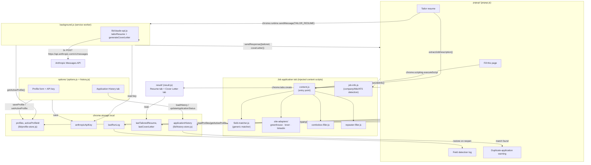

# Design

Architecture, algorithms, and known limitations for the Job Application
Autofill + Resume Tailoring extension. See [README.md](README.md) for
install/usage.

## Architecture overview

The extension is Manifest V3: a background service worker, a popup, an
options page, and content scripts injected on demand (no persistent content
scripts declared in `manifest.json` — the popup injects them via
`chrome.scripting.executeScript` only when you click a button). Components
never call each other's functions directly; they only share
`chrome.storage.local` and Chrome's message-passing APIs.



Why the API key never reaches the job site's page: `lib/claude-api.js` only
runs inside `background.js`, the service worker, which has no DOM and is
never injected into a web page. The popup only ever ships the job
description *text* to the background script via `chrome.runtime.sendMessage`
— the page's own JavaScript never sees the key.

### Components

- **`background.js`** — service worker; the only place that calls the
  Claude API. Listens for a `TAILOR_RESUME` message, reads the active
  profile and API key from storage, calls `lib/claude-api.js`'s
  `tailorResume()` and `generateCoverLetter()`, and replies with both
  results.
- **`popup/`** — the toolbar UI. Injects content scripts into the active
  tab, calls their exposed functions via `chrome.scripting.executeScript`,
  renders the field detection log, hosts the profile switcher, checks for
  a duplicate application as soon as it opens, and logs a history entry
  after each successful fill/tailor.
- **`options/`** — two tabs. `options.js` owns the profile-editing form
  (personal info, education, experience, resume text, skills) plus the
  shared API key field, and talks to storage only through
  `lib/profile-store.js`. `history.js` owns the **Application History**
  tab (search/filter/sort, per-row status picker, remove), talking to
  storage only through `lib/history-store.js`. Deep-linkable to the
  history tab via `options.html#history`.
- **`content/`** — injected into the job-application page on click (not
  auto-injected on page load). `content.js` is the entry point; it wires
  the generic matcher, whichever site adapter matches the hostname, the
  combobox filler, and the repeater filler together and exposes
  `fillCurrentPage()` / `extractJobDescription()` on `window`. `job-info.js`
  is a separate, independent content script exposing `extractJobInfo()` —
  best-effort company name / job title / ATS platform detection, used by
  both application history and the duplicate-application warning.
- **`lib/profile-store.js`** — the only code that reads/writes profile data
  in `chrome.storage.local`; every other component goes through it so a
  read from the popup, options page, and background worker always agree.
- **`lib/history-store.js`** — the only code that reads/writes
  `applicationHistory` in `chrome.storage.local`. Same one-module-owns-one-
  key discipline as `profile-store.js`: `logApplication()`,
  `updateApplicationStatus()`, `deleteApplication()`,
  `findRecentApplicationsForCompany()`.
- **`lib/claude-api.js`** — thin wrapper around the Messages API.
  `tailorResume()` and `generateCoverLetter()` share a `callClaude()`
  helper (same POST-a-system-and-user-turn, parse-the-text-back-out shape,
  different prompts and token budgets).
- **`result/`** — a plain tab with two sub-tabs (Tailored Resume / Cover
  Letter) that reads `lastTailoredResume` and `lastCoverLetter` from
  storage and shows whichever tab is active, each with its own copy
  button.

### Content script loading model

Content scripts are **not** declared in `manifest.json` as
`content_scripts` (which would auto-run on every page load). Instead,
`popup.js` injects a fixed list of files (`CONTENT_FILES`) via
`chrome.scripting.executeScript` only when you click "Fill this page" or
"Tailor resume." Each file is a plain script (not an ES module) that
attaches its exports to `window` as a side effect (`window.__jobAutofill`,
`window.__jobAutofillSiteAdapters`, `window.__jobAutofillCombobox`,
`window.__jobAutofillRepeater`, `window.__jobAutofillContent`) so the
files can call into each other despite each being injected separately —
they share the page's JS "world." This is also why the Jest tests
`require()` these files for their side effect and then exercise them
through those globals, rather than importing named exports.

## Field-matching algorithm (`content/field-matcher.js`)

For every visible, enabled `input`/`textarea`/`select` (excluding hidden,
submit, button, and file inputs, which are handled separately), the matcher
gathers every plausible source of "what is this field asking for" text, in
priority order:

1. **`<label for>`** referencing the field's id, or a wrapping `<label>`.
2. **`aria-label`** on the element.
3. **`aria-labelledby`**, resolved to the referenced element(s)' text.
4. **`placeholder`** attribute.
5. **Humanized `name`/`id`** — camelCase and `snake-case`/`kebab-case`
   converted to lowercase words (`firstName` → "first name").
6. **Nearby-text fallback** — for forms that put the question in a plain
   sibling `<div>` instead of a real label (common on custom-built question
   cards, e.g. Lever's `.application-label`): walks up to 4 ancestor levels,
   at each level checking elements immediately *before* the field's branch
   for a class name matching `label` or `question`. Deliberately narrow —
   searching a whole ancestor's subtree would pick up unrelated label text
   from other questions on the same page.

All gathered text is matched against `FIELD_DEFINITIONS`, a list of
`{ key, keywords }` pairs (e.g. `firstName` → `["first name", "given
name", "fname"]`), picking the definition whose matched keyword is longest
(so "first name" wins over a bare "name" match). The winning key is looked
up in a flattened view of the active profile (`flattenProfile()` — pulls
the most recent education/experience entry into flat keys like `school`,
`currentCompany`) to get the value to fill.

**Radio groups** are matched at the group level, once per `name` attribute:
the *question* text comes from the closest `<fieldset><legend>`, an
`aria-label`/heading on a `role="radiogroup"`/`role="group"` ancestor, or
the same nearby-text fallback; then the specific option ("Yes"/"No") is
matched by its own label text via `fillRadioGroup()`.

**Setting values** goes through `setNativeValue()` rather than
`el.value = x`, because React (and similar frameworks) override the native
value setter to track changes — direct assignment is silently ignored.
`setNativeValue()` calls the native `HTMLInputElement`/`HTMLTextAreaElement`
/`HTMLSelectElement` prototype's setter explicitly, then dispatches `input`
and `change` events so the framework's own listeners fire.

### Confidence tiers

Recorded per-field in the run log (`matchConfidence()`), based on which
*kind* of source produced the winning keyword match:

| Tier | Source | Rationale |
| --- | --- | --- |
| High | `<label>`, `aria-label`, `aria-labelledby` | The page explicitly names the field, for sighted users and screen readers alike. |
| Medium | `placeholder`, humanized `name`/`id` | A same-element attribute, but not necessarily written to be read as a sentence. |
| Low | nearby-text fallback | A heuristic guess about which nearby text is the question — last resort. |

The full log (one entry per candidate field: description, matched key,
confidence, filled/not, and a reason when not filled) is returned from
`fillPage()`, merged in `content.js` with adapter-filled fields (recorded
as synthetic high-confidence entries), and rendered by the popup.

## Site-adapter pattern

`content/site-adapters/*.js` each register themselves on
`window.__jobAutofillSiteAdapters` keyed by name, with a
`{ hostnameMatch, fill(profile, setNativeValue) }` shape. `content.js`
picks the first adapter whose `hostnameMatch` substring appears in
`window.location.hostname`, runs its `fill()` first, then always runs the
generic matcher afterward over whatever the adapter didn't already fill in
(the generic pass's `if (el.value) skip` check prevents re-filling
adapter-handled fields).

**Why this split** — the generic matcher is deliberately the default, and
adapters only add the handful of selectors the generic matcher's
heuristics can't reach:

- **Greenhouse**: core identity fields (`#first_name`, `#last_name`,
  `#email`, `#phone`, `#country`) have stable ids, so the adapter grabs
  those directly. Every custom question gets a dynamically generated id
  per posting but carries a real `aria-label`, so those fall through to
  the generic matcher untouched.
- **Lever**: core fields use plain `name` attributes with no id or
  aria-label (`name="name"` — one full-name field, not split — plus
  `email`, `phone`, `org`, `location`). Custom questions
  (`cards[uuid][field0]`-style names) have no id/aria-label at all; their
  text lives in a sibling `.application-label` div, which the generic
  matcher's nearby-text fallback already reads.
- **LinkedIn**: see [Known limitations](#known-limitations--unverified).

A generic-matcher-first, adapter-as-precision-layer design means a brand
new ATS with no adapter at all still gets partial autofill for free (any
field with a real label/aria-label/placeholder), and each adapter only
needs to cover what's left — not reimplement the whole form.

### Multi-step forms (Workday, LinkedIn)

Both Workday and LinkedIn Easy Apply are multi-step (a wizard across page
loads, and a modal dialog across steps, respectively). Neither adapter
tries to advance the wizard/modal itself — you click "Fill this page"
again on each step as you reach it, and the extension only ever fills what
is currently on screen. Workday additionally needs two other content
scripts beyond the field-matcher and its adapter:

- **`combobox-filler.js`** — handles Workday's custom
  `<button aria-haspopup="listbox">` dropdowns (Country, State, Degree) by
  clicking the button, waiting for the option panel to render, then
  clicking the matching `role="option"`; and live-search typeahead inputs
  (School, Field of Study) by typing the value and clicking a matching
  suggestion if one appears (best-effort — the site's own lookup table may
  not contain the value).
- **`repeater-filler.js`** — handles "Add Another" sections (Work
  Experience, Education) that start empty: clicks Add once per profile
  entry, waits for each new set of fields to render, and fills them by
  label text (not id) so the same code has a reasonable shot at other
  sites built the same pattern. Also splits stored `startDate`/`endDate`
  text ("Jun 2023") into separate Month/Year fields.

## Multi-profile data model (`lib/profile-store.js`)

```
chrome.storage.local:
  profiles: { [profileId]: ProfileRecord }
  activeProfileId: string
  anthropicApiKey: string   // shared across all profiles, not part of ProfileRecord
```

`ProfileRecord` = `{ name, firstName, lastName, email, phone, address,
city, state, zip, country, linkedin, github, website, authorizedToWork,
needsSponsorship, gender, raceEthnicity, veteranStatus, disabilityStatus,
skills[], resumeText, education[], experience[] }`.

Every reader/writer (popup, options page, background worker) goes through
`loadProfiles()` / `getActiveProfile()` / `saveProfile()` /
`createProfile()` / `deleteProfile()` / `setActiveProfile()` in this one
module, so profile data can't drift out of sync between components.
`loadProfiles()` also migrates a legacy single `profile` key (from
before multi-profile support) into `profiles: { [newId]: { name:
"Default", ...oldProfile } }` the first time it's called after an update —
a one-time, silent, lossless migration. Deleting the only remaining
profile is rejected (`deleteProfile` throws) since the extension always
needs at least one active profile.

## Application-history data model (`lib/history-store.js`)

```
chrome.storage.local:
  applicationHistory: { [entryId]: HistoryEntry }
```

`HistoryEntry` = `{ id, company, jobTitle, url, atsPlatform, timestamp,
status, statusUpdatedAt }`, where `status` is one of `APPLICATION_STATUSES`
= `["applied", "interviewing", "rejected", "offer"]`. New entries always
start at `"applied"` — that's what a logged fill/tailor run means until
you update it. Every reader/writer (popup, options page's history tab)
goes through this module's `loadHistory()` / `logApplication()` /
`updateApplicationStatus()` / `deleteApplication()` /
`findRecentApplicationsForCompany()`, same discipline as
`lib/profile-store.js`.

## Resume-tailoring and cover-letter flow

1. Popup's **Tailor resume for this job** button injects content scripts
   (if not already present) and calls `extractJobDescription()`, which
   tries a few common ATS container selectors (`[class*="job-description"
   i]`, `#content`, `main`, `article`, ...) before falling back to the
   whole page's visible text, capped at 12,000 characters.
2. Popup sends `{ type: "TAILOR_RESUME", jobDescription }` via
   `chrome.runtime.sendMessage` to `background.js`.
3. `background.js` reads the API key and active profile's `resumeText`
   from storage, and calls `tailorResume()` in `lib/claude-api.js`.
4. `lib/claude-api.js` POSTs to `https://api.anthropic.com/v1/messages`
   with a system prompt instructing Claude to reorder/rephrase/re-emphasize
   but never invent experience, skills, titles, dates, or accomplishments
   not already in the base resume — and to list unmet requirements under a
   "Gaps to consider" section instead of fabricating them. Output is plain
   text (no markdown formatting) so it's paste-ready.
5. Still inside the same `TAILOR_RESUME` handler, `background.js` makes a
   **second**, independent Claude call — `generateCoverLetter()` — with the
   same job description and base resume text, a different system prompt
   (short, 3-4 paragraphs, ties specific resume experience to the posting,
   no invented claims, no bracketed placeholders, signs off with the
   active profile's name), and a smaller 900-token budget. If this second
   call fails, it doesn't take down the first: the handler catches the
   error separately and returns `coverLetterError` alongside the
   already-successful `tailored` text, rather than failing the whole
   message.
6. The tailored resume and cover letter (or `coverLetterError`) are saved
   to `chrome.storage.local` as `lastTailoredResume` / `lastCoverLetter` /
   `lastCoverLetterError`, and a new tab opens `result/result.html`, which
   reads those keys and shows them in two tabs (Tailored Resume / Cover
   Letter), each with its own copy-to-clipboard button. A missing/failed
   cover letter shows an explanatory message in its tab instead of blank
   text.
7. Either way, the popup then calls `content/job-info.js`'s
   `extractJobInfo()` on the tab and logs one entry to application history
   via `logApplication()` — see below.

## Application history and the duplicate-application warning

**Logging** (`lib/history-store.js`, storage key `applicationHistory`):
after a successful "Fill this page" or "Tailor resume" run, `popup.js`
calls `content/job-info.js`'s `extractJobInfo()` on the active tab to get
`{ company, jobTitle, atsPlatform, url }`, then `logApplication()` writes
one `HistoryEntry` (adding `id`, `timestamp`, and a default `status` of
`"applied"`). This is best-effort and non-blocking by design: it runs
*after* the fill/tailor result is already shown to the user, and any
failure (detection came back empty, storage write failed) is caught and
logged to the console rather than surfaced — a missed history entry should
never look like a failed fill.

`content/job-info.js` detects the ATS platform from the hostname (solid —
`greenhouse.io` / `lever.co` / `linkedin.com` / `myworkdayjobs.com`
substring matches), then company name and job title through a per-ATS
chain of selectors and URL conventions (Greenhouse/Lever: first URL path
segment; Workday: subdomain; LinkedIn: top-card selectors) falling back to
`og:site_name`/`og:title` meta tags, and finally to parsing
`document.title` for an "X at Y" or "Y - X" pattern. Like company/title
detection, this is **unverified against live postings** — see [Known
limitations](#known-limitations--unverified). An empty detection just
means `logApplication()` falls back to "Unknown company" / "Unknown
title", not a broken fill.

**The Application History tab** (`options/history.js`) renders every
entry from `loadHistory()` with a search box (matches company + job
title), a status filter, and a sort control (newest/oldest/company A-Z).
Each row's status `<select>` calls `updateApplicationStatus()` directly on
change; a remove button calls `deleteApplication()` after a confirm
prompt. It's a second `<script type="module">` on `options.html`,
independent of `options.js`'s profile form — `options.js` only owns the
page-level Profile/History tab switching.

**The duplicate-application warning** runs in the popup as soon as it
opens — before the user clicks anything — precisely so it's seen ahead of
the action it's warning about, not just logged alongside it:
`checkDuplicateWarning()` injects `job-info.js`, calls `extractJobInfo()`
for the current tab's company, then
`findRecentApplicationsForCompany(company)` (case-insensitive, trimmed
exact match, 90-day window by default) against history. A match renders a
non-blocking amber banner ("You already applied to \<company\> on \<date\>
(status: \<status\>)"); Fill/Tailor stay enabled regardless — this is a
heads-up, not a gate. No match, no company detected, or an inspectable-tab
failure (chrome:// pages, etc.) all just hide the banner silently.

## Known limitations / unverified

- **LinkedIn Easy Apply adapter is unverified against a live posting.**
  `content/site-adapters/linkedin.js` is based on Easy Apply's publicly
  documented DOM conventions (the same id-suffix pattern —
  `...-firstName`, `...-phoneNumber-nationalNumber` — that several
  open-source LinkedIn auto-apply tools rely on) and traced by hand against
  a constructed HTML fixture (`__tests__/linkedin-adapter.test.js`), not a
  real page. It only handles first name, last name, and mobile phone by id
  suffix; email, address, and EEO/voluntary-disclosure radios are left to
  the generic matcher (they're documented to carry real labels/aria-labels
  in LinkedIn's own markup). Not handled at all: the phone country-code
  dropdown, and the home-city field if rendered as a live-search
  typeahead. Check the popup's field detection log the first time you use
  it on a real posting — LinkedIn's markup changes periodically.
- **Workday step-by-step caveats**: Workday's application is a multi-step
  wizard (My Information → My Experience → Application Questions →
  Voluntary Disclosures → Self Identify → Review); "Fill this page" only
  fills the step currently on screen, so it must be re-clicked at each
  step. Within that:
  - Country/State/Degree are custom listbox-button widgets handled by
    `combobox-filler.js`; a short delay is required between "close
    anything else open" and "open this one" clicks because firing them in
    the same tick lets React batch them into a no-op.
  - School and Field of Study are live server-backed search fields — a
    typed value can come back with zero suggestions depending on the
    site's own lookup table, and Workday itself (not a bug in this
    extension) clears the field back to empty if you tab away with no
    suggestion selected.
  - "How Did You Hear About Us" is not filled — it's not something a
    personal profile has an answer for, and it's typically a two-level
    cascading menu the current combobox handling doesn't attempt.
- **File uploads** can never be filled by any browser extension — browsers
  block scripts from setting a file input's value for security reasons.
- **Lever's location field** is a typeahead backed by an address
  autocomplete service; the extension fills the text, but Lever may still
  expect a dropdown suggestion click for the value to fully register.
- **Claude API key is stored unencrypted** in `chrome.storage.local` — fine
  for a personal-use tool, but don't share your browser profile.
- **Resume tailoring and cover letter generation are bounded by what's
  already in the saved resume text** — Claude is instructed not to invent
  experience; review output before sending it anywhere.
- **Company/job-title/ATS detection (`content/job-info.js`) is unverified
  against live postings**, the same caveat as the LinkedIn adapter above:
  built from each ATS's documented URL/DOM conventions and traced against
  constructed HTML fixtures (`__tests__/job-info.test.js`), not real pages.
  ATS-platform detection (from hostname) is solid; company-name/job-title
  text extraction is a heuristic fallback chain that can come back empty
  or wrong if a site's markup doesn't match the assumed conventions — in
  which case a history entry logs as "Unknown company"/"Unknown title," or
  the duplicate-application warning simply doesn't fire. Neither failure
  mode blocks filling or tailoring.
- **The duplicate-application warning is a same-name match only** — no
  fuzzy matching, so "Acme" and "Acme Corp" are treated as different
  companies. Deliberate: a missed near-duplicate is a safer failure mode
  for a non-blocking warning than false-flagging an unrelated company.
